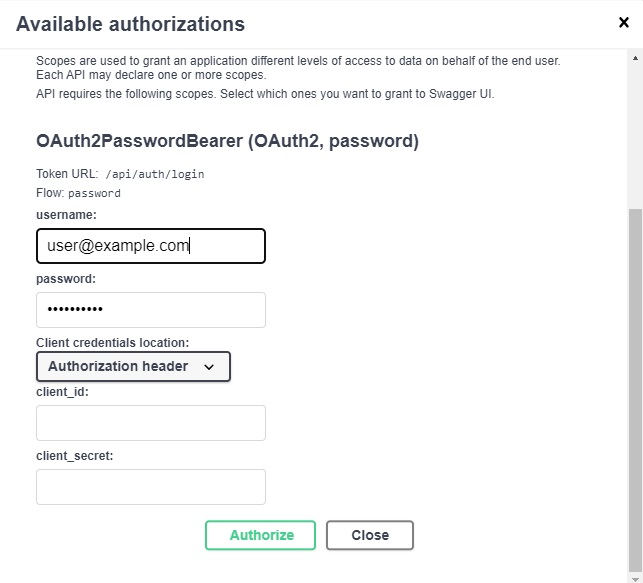
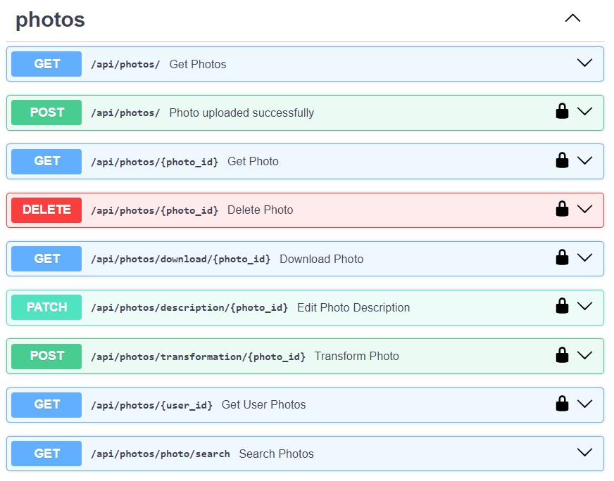
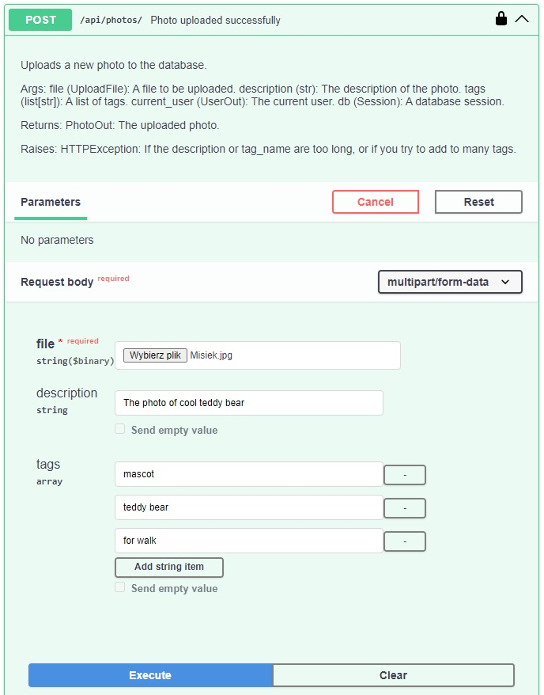
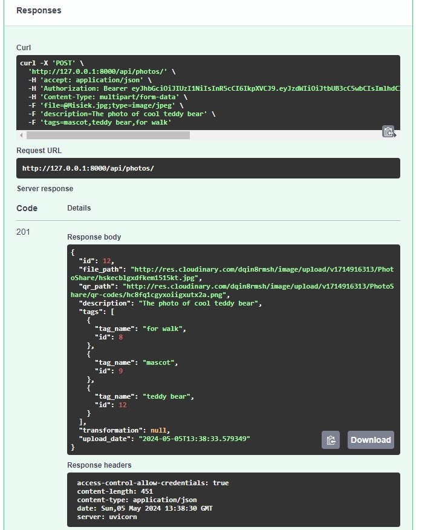

# PhotoShare - Aplikacja do udostępniania zdjęć
## Wstęp
>  W obliczu stale rosnącej liczby cyfrowych zdjęć, które zajmują coraz więcej miejsca na dyskach i w chmurach, istnieje pilna potrzeba skutecznego zarządzania tymi wspomnieniami. 
> Tradycyjne odbitki stopniowo ustępują miejsca cyfrowym kolekcjom, tworząc chaos w naszych zbiorach. 
> 
> **PhotoShare** przychodzi z pomocą, oferując kompleksowe rozwiązanie, które nie tylko porządkuje nasze zdjęcia, ale także umożliwia kreatywne dzielenie się nimi i bezpieczne przechowywanie. 
> Dzięki funkcjom uwierzytelniania i autoryzacji, PhotoShare zapewnia kontrolę nad prywatnością danych. Odkryj, jak nasza aplikacja ułatwia zarządzanie Twoimi cyfrowymi wspomnieniami. 
> 

## Język / Language

- [Polski / Polish](#spis-treści)
- [Angielski / English](#table-of-contents)

## Spis treści

- [Informacje ogólne](#informacje-ogólne)
- [Wymagane zależności](#wymagane-zależności)
- [Instalacja](#instalacja)
- [Uruchomienie aplikacji](#uruchomienie-aplikacji)
- [Instrukcja generowania dokumentacji Sphinx](#Instrukcja-generowania-dokumentacji-Sphinx)
- [Dokumentacja API](#dokumentacja-API)
- [Funkcje](#funkcje)
- [Przykład użycia](#Przykład-użycia)
- [Licencja](#licencja)
- [Autorzy](#autorzy)
- [Kontakt](#kontakt)

## Informacje ogólne

### Zdefiniowanie problemu rozwiązywanego przez PhotoShare
W dzisiejszych czasach, gromadzenie cyfrowych zdjęć staje się coraz bardziej chaotyczne, podczas gdy tradycyjne odbitki odchodzą w zapomnienie. PhotoShare zapewnia kompleksowe rozwiązanie, umożliwiając uporządkowanie, kreatywne dzielenie się i bezpieczne przechowywanie zdjęć. Dzięki funkcji uwierzytelniania i autoryzacji, zapewnia bezpieczeństwo danych i ogranicza dostęp do pewnych funkcji tylko dla uprawnionych użytkowników.

### Cele projektu

Główne cele PhotoShare obejmują:

1. Stworzenie intuicyjnego interfejsu użytkownika.
2. Umożliwienie łatwego przesyłania, przeglądania i przetwarzania zdjęć. 
3. Umożliwienie oznaczania zdjęć tagami. 
4. Implementacja funkcji komentowania zdjęć.
5. Zabezpieczenie aplikacji przed atakami typu CSRF, SQL injection itp. 
6. Wdrożenie autoryzacji i uwierzytelniania użytkowników. 
7. Ochrona danych użytkowników poprzez szyfrowanie i bezpieczne praktyki przechowywania haseł.


## Wymagane zależności

Upewnij się, że na Twoim komputerze zainstalowany jest Python 3.11 lub nowszy.

Aplikacja korzysta z następujących bibliotek:
- `uvicorn~=0.29.0`
- `fastapi~=0.110.2`
- `redis~=5.0.4`
- `python-dotenv~=1.0.1`
- `SQLAlchemy~=2.0.29`
- `cloudinary~=1.40.0`
- `passlib`
- `pydantic~=2.7.1`
- `libgravatar~=1.0.4`
- `alembic~=1.13.1`
- `pydantic[email]`
- `python-multipart`
- `libgravatar`
- `python-jose[cryptography]`
- `passlib[bcrypt]`
- `fastapi-mail`
- `cloudinary`
- `bcrypt~=4.1.2`
- `qrcode[pil]`


## Instalacja
### 1. Pobierz repozytorium:
```
git clone https://github.com/Szumapman/PhotoShare
```
### 2. Przejdź do katalogu z aplikacją np.:
```
cd PhotoShare
```

### 3. Instalacja zależności:

```pip install -r requirements.txt```

To polecenie instaluje wszystkie zależności wymagane przez projekt, korzystając z pliku **requirements.txt**.

### 4. Konfiguracja środowiska:

#### _Plik konfiguracyjny_
Utwórz plik `.env` w głównym katalogu i podaj niezbędne zmienne środowiskowe zgodnie z przykładowym plikiem `env`.

#### _Docker Compose_

Przed uruchomieniem aplikacji lokalnie upewnij się, że masz zainstalowany **Docker Compose**.
Uruchom poniższe polecenie w terminalu, aby zbudować i uruchomić kontenery:
```
docker-compose up -d 
```
#### _Baza danych PostgreSQL_

Po uruchomieniu kontenerów Docker Compose, aplikacja automatycznie utworzy bazę danych PostgreSQL.

#### _Migracje Alembic_

Przed uruchomieniem Alembica upewnij się, że baza danych jest skonfigurowana zgodnie z plikiem konfiguracyjnym, co umożliwi bezproblemowe przeprowadzenie migracji. Następnie po uruchomieniu kontenerów Docker Compose wykonaj migracje Alembic, aby skutecznie zaimplementować schemat bazy danych
```
alembic upgrade head
```

#### _Redis_

Redis jest używany do przechowywania danych podręcznych. Kontener Redis jest automatycznie uruchamiany wraz z innymi kontenerami Docker Compose.


## Uruchomienie aplikacji:

Po skonfigurowaniu środowiska uruchom aplikację lokalnie za pomocą następującej komendy:

```
uvicorn main:app --reload
```

Ta komenda uruchomi serwer FastAPI lokalnie. Domyślnie serwer będzie działał pod adresem http://127.0.0.1:8000.


## Instrukcja generowania dokumentacji Sphinx

Sphinx to narzędzie do generowania dokumentacji w języku Python.

## Instalacja Sphinx

Aby zainstalować Sphinx, użyj narzędzia pip. Możesz to zrobić, wykonując poniższą komendę w terminalu:

```
pip install sphinx
```

### Generowanie dokumentacji

1. Przejdź do katalogu głównego projektu:

```
cd PhotoShare
```

2. Uruchom inicjalizację Sphinx, która wygeneruje podstawowe pliki konfiguracyjne i strukturę katalogów. Możesz to zrobić, wykonując poniższą komendę:

```
sphinx-quickstart <nazwa_katalogu>
```

3. Postępuj zgodnie z instrukcjami na ekranie, aby skonfigurować Sphinx. Kiedy zostaniesz zapytany `Separate source and build directories (y/n) [n]:`, wpisz `n` lub naciśnij `Enter`.
4. Po zakończeniu inicjalizacji, zastąp pliki w nowo utworzonym katalogu plikami z katalogu `docs`:

- `Makefile`
- `conf.py`
- `index.rst`
- `make.bat`

5. Przejdź do utworzonego katalogu w terminalu i ustaw go jako bieżący:

```
cd <nazwa_utworzonego_katalogu>
```

6. Po wykonaniu tych kroków, wygeneruj dokumentację, wykonując polecenie:

```
.\make.bat html
```

Po wykonaniu powyższych kroków, projekt dokumentacji będzie dostępny w folderze `docs/_build/html`. Punkt wejścia do dokumentacji znajduje się w `docs/_build/html/index.html`. Po jego otwarciu powinieneś zobaczyć dokumentację Sphinx.


## Dokumentacja API

Dokumentacja API jest automatycznie generowana przez FastAPI i można uzyskać do niej dostęp, przechodząc pod adres http://127.0.0.1:8000/docs w przeglądarce internetowej. Ta interaktywna dokumentacja zawiera szczegóły dotyczące wszystkich dostępnych punktów końcowych, parametrów żądania, ciał żądania/odpowiedzi oraz wymagań dotyczących uwierzytelnienia.


## Funkcje
- **Uwierzytelnianie użytkownika:** Użytkownicy mogą bezpiecznie rejestrować się, logować i wylogowywać się. Autoryzacja odbywa się za pomocą tokenów JWT.
- **Przesyłanie zdjęć:** Użytkownicy mogą przesyłać zdjęcia na platformę Cloudinary.
- **Transformacja zdjęć:** Użytkownicy mogą stosować różne transformacje do przesłanych zdjęć, takie jak zmiana rozmiaru, przycinanie i stosowanie efektów.
- **Oznaczanie:** Użytkownicy mogą oznaczać swoje zdjęcia opisowymi tagami, aby uczynić je bardziej widocznymi.
- **Komentowanie:** Użytkownicy mogą zostawiać komentarze pod zdjęciami.
- **Administracja:** Administratorzy mają dostęp do dodatkowych funkcji, takich jak zarządzanie użytkownikami i moderowanie treści.


## Przykład użycia

>### _Wczytywanie zdjęcia z opisem i tagami_
> 
### Autoryzacja użytkownika


### Lista dostępnych endpoints dla zdjęć


### Wczytywanie wybranego zdjęcia, dodawanie opisu i tagów


### Odpowiedź ze serwera


## Licencja

Ta aplikacja jest udostępniana na licencji MIT.

## Autorzy

- 'Alex Kruh'
- 'Beata Chrząszcz'
- 'Paweł Sakowicz'
- 'Paweł Szumański'
- 'Sabina Limmer'

## Kontakt

Jeśli masz pytania, sugestie lub chciałbyś się skontaktować w sprawie aplikacji, skontaktuj się z nami:

- GitHub Alex Kruh: [OlekKruh](https://github.com/OlekKruh)
- GitHub Beata Chrząszcz: [BettyBeetle](https://github.com/BettyBeetle)
- GitHub Paweł Sakowicz: [pawel544](https://github.com/pawel544)
- GitHub Paweł Szumański: [Szumapman](https://github.com/Szumapman)
- GitHub Sabina Limmer: [SabinaLimmer](https://github.com/SabinaLimmer)

## Table of Contents

- [General Information](#general-information)
- [Configuration](#Configuration)
- [Installation](#installation)
- [Running the application](#running-the-application)
- [Sphinx Documentation Generation Guide](#Sphinx-Documentation-Generation-Guide)
- [API Documentation](#API-documentation)
- [Features](#features)
- [Usage example](#Usage-example)
- [Licence](#licence)
- [Authors](#authors)
- [Contact](#contact)


## General Information
### Defining the Problem Solved by PhotoShare

In today's world, the accumulation of digital photos is becoming increasingly chaotic, while traditional prints are fading into obscurity. PhotoShare provides a comprehensive solution, enabling users to organize, creatively share, and securely store photos. Through authentication and authorization features, it ensures data security and restricts access to certain functions only to authorized users.

## Project Goals
The main goals of PhotoShare include:

1. Creating an intuitive user interface. 
2. Enabling easy uploading, browsing, and processing of photos. 
3. Allowing tagging of photos. 
4. Implementing photo commenting features. 
5. Securing the application against CSRF, SQL injection, etc. 
6. Implementing user authentication and authorization. 
7. Protecting user data through encryption and secure password storage.

## Configuration
Make sure Python 3.11 or later is installed on your computer.

The application uses the following packages:

- `uvicorn~=0.29.0`
- `fastapi~=0.110.2`
- `redis~=5.0.4`
- `python-dotenv~=1.0.1`
- `SQLAlchemy~=2.0.29`
- `cloudinary~=1.40.0`
- `passlib`
- `pydantic~=2.7.1`
- `libgravatar~=1.0.4`
- `alembic~=1.13.1`
- `pydantic[email]`
- `python-multipart`
- `libgravatar`
- `python-jose[cryptography]`
- `passlib[bcrypt]`
- `fastapi-mail`
- `cloudinary`
- `bcrypt~=4.1.2`
- `qrcode[pil]`


## Installation
### 1. Clone the Repository:

```
git clone https://github.com/Szumapman/PhotoShare
```

### 2. Navigate to the Application Directory:

```
cd PhotoShare
```

### 3. Install Dependencies:

```pip install -r requirements.txt```

This command installs all dependencies required by the project using the **requirements.txt file**.

### 4. Configure the Environment:

#### _Configuration File_
Create a `.env` file in the main directory and provide the necessary environment variables according to the sample `env` file.


#### _Docker Compose_
Before running the application locally, make sure you have **Docker Compose** installed.
Run the following command in the terminal to build and start the containers::

```
docker-compose up -d 
```

#### _PostgreSQL Database_
After starting the Docker Compose containers, the application will automatically create the PostgreSQL database.

#### _Migrations Alembic_

Before initiating Alembic, ensure the database is configured according to the configuration file, enabling seamless application of migrations. Subsequently, upon launching Docker Compose containers, execute Alembic migrations to implement the database schema effectively.
```
alembic upgrade head
```

#### _Redis_
Redis is used for caching data. The Redis container is automatically launched along with other Docker Compose containers.

## Running the Application:
After configuring the environment, run the application locally using the following command:
```
uvicorn main:app --reload
```
This command will start the FastAPI server locally. By default, the server will run at http://127.0.0.1:8000.


## Sphinx Documentation Generation Guide

Sphinx to narzędzie do generowania dokumentacji w języku Python.

## Instalacja Sphinx

Sphinx is a tool used to generate documentation in Python.

```
pip install sphinx
```

### Generating Documentation

1. Navigate to the main project directory:

```
cd PhotoShare
```

2. Initiate Sphinx, which will generate basic configuration files and directory structure. You can do this by executing the following command:

```
sphinx-quickstart <directory_name>
```

3. Follow the on-screen instructions to configure Sphinx. When prompted with `Separate source and build directories (y/n) [n]:`, type `n` or press `Enter`.
4. After initialization, replace the files in the newly created directory with files from the `docs` directory:
- `Makefile`
- `conf.py`
- `index.rst`
- `make.bat`

5. Navigate to the created directory in the terminal and set it as the current directory:

```
cd <directory_name>
```

6. After completing these steps, generate the documentation by executing the command:

```
.\make.bat html
```

After completing the above steps, the documentation project will be available in the `docs/_build/html` folder. The entry point to the documentation is located at `docs/_build/html/index.html`. Upon opening it, you should see the Sphinx documentation.


## API Documentation
API documentation is automatically generated by FastAPI and can be accessed by visiting http://127.0.0.1:8000/docs in a web browser. This interactive documentation provides details on all available endpoints, request parameters, request/response bodies, and authentication requirements.

## Features
- **User Authentication:** Users can securely register, log in, and log out. Authentication is performed using JWT tokens.
- **Photo Upload:** Users can upload photos to Cloudinary platform.
- **Photo Transformation:** Users can apply various transformations to uploaded photos, such as resizing, cropping, and applying effects.
- **Tagging:** Users can tag their photos with descriptive tags to make them more visible.
- **Commenting:** Users can leave comments on photos.
- **Administration:** Administrators have access to additional features such as user management and content moderation.


## Usage example

### User authentication


### List of available endpoints for photos


### Uploading a selected photo, adding description and tags


### Server response


## Licence

This application is provided under the MIT license.

## Authors

- 'Alex Kruh'
- 'Beata Chrząszcz'
- 'Paweł Sakowicz'
- 'Paweł Szumański'
- 'Sabina Limmer'

## Contact

If you have any questions, suggestions, or would like to get in touch regarding the application, feel free to contact us.:

- GitHub Alex Kruh: [OlekKruh](https://github.com/OlekKruh)
- GitHub Beata Chrząszcz: [BettyBeetle](https://github.com/BettyBeetle)
- GitHub Paweł Sakowicz: [pawel544](https://github.com/pawel544)
- GitHub Paweł Szumański: [Szumapman](https://github.com/Szumapman)
- GitHub Sabina Limmer: [SabinaLimmer](https://github.com/SabinaLimmer)
